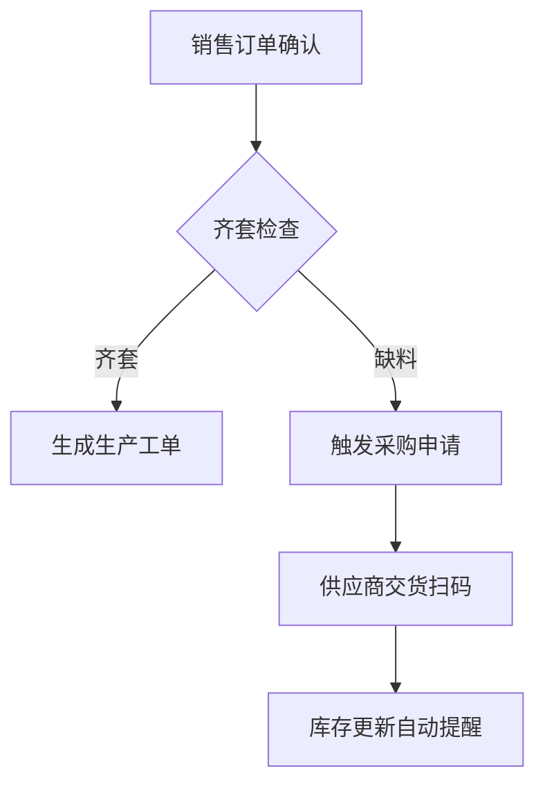

### **一、行业特点与需求分析**
**1.1 PCB行业特性**
- **订单特征**：多品种小批量（60%订单≤500片），平均订单交期7天，紧急订单占比25%
- **生产工艺**：涉及开料→内层线路→压合→钻孔→电镀→外层线路→防焊→表面处理→成型→测试等12道核心工序
- **质量控制**：关键工序（如蚀刻、阻抗测试）需100%全检，平均不良率需控制在0.8%以下
- **物料管理**：涉及覆铜板（CCL）、干膜、化学药水等2000+SKU，BOM层级3-5层
- **设备管理**：SMT生产线2条，钻孔机12台，电镀线3条，设备OEE需提升至75%

**1.2 现存痛点**
- 生产计划排程效率低（计划员每日花费4小时手工排程）
- 材料齐套率仅68%导致延期
- 质量追溯需手动翻查3个独立系统
- 计件工资核算误差率5%
- 设备状态监控依赖人工巡检

---

### **二、系统架构设计**
**2.1 技术架构**
```
[硬件层]
  ├─海康威视门禁系统
  ├─PLC设备（15台）
  ├─工业条码打印机（6台）
  ├─PDA扫码终端（30台）
  │
[数据层]
  ├─PostgreSQL集群（主从备份）
  ├─时序数据库（存储设备数据）
  │
[平台层]
  ├─Odoo社区版v16（核心ERP）
  ├─Python中间件（设备接口）
  ├─Node-RED（工作流引擎）
  │
[应用层]
  ├─生产管理 █ 质量管理 █ 设备监控
  ├─条码系统 █ 计件工资 █ 安防集成
```

**2.2 功能模块开发计划**

| 模块            | 社区版适配度 | 开发量 | 关键功能点                                                                 |
|-----------------|--------------|--------|----------------------------------------------------------------------------|
| 生产计划        | 30%          | ★★★★   | APS智能排程、模具管理、插单模拟                                           |
| 材料齐套        | 40%          | ★★★☆   | 动态齐套检查、替代料提醒、缺料看板                                        |
| 质量模块        | 20%          | ★★★★   | IPC-A-600G标准库、SPC分析、8D报告                                         |
| 设备数采        | 0%           | ★★★★★ | OPC UA协议对接、设备状态监控（稼动率/故障代码）                           |
| 扫码报工        | 10%          | ★★★☆   | 工序扫码（精确到机台）、良品/不良品分类录入                               |
| 计件工资        | 15%          | ★★★★   | 阶梯式计价（0-1000件/1001-2000件）、质量系数浮动（±20%）                  |
| 安防集成        | 0%           | ★★☆    | 门禁记录关联考勤、生产区权限控制（不同工序人员通行限制）                  |

---

### **三、核心业务场景实现方案**
**3.1 生产计划联动（示例）**
```
销售订单（含急单标识） → MRP运算（考虑模具可用性） → APS自动排程（约束条件： 
  ① 电镀线最大负载8小时 
  ② 相同板材订单合并 
  ③ 交期倒排） → 生成可视化甘特图（可手动调整）
```

**3.2 材料齐套检查流程**


**3.3 质量追溯实现**
- 通过条码串联：
  `原材料批次号 → 生产工单号 → 设备参数记录 → 检验报告（含图片） → 成品序列号`

**3.4 设备数采方案**
- 采集频率：关键设备（每分钟），普通设备（每15分钟）
- 数据项：电流值/温度/压力等工艺参数、故障代码（映射标准库）
- 异常处理：连续3次超限自动停机并推送告警

---

### **四、实施规划与里程碑**
**4.1 项目阶段划分**
```
Phase 1 需求深化（3周）
  ├─现状流程测绘（输出32个业务流程图）
  ├─差异分析（识别87个功能缺口）
  
Phase 2 系统开发（12周）
  ├─核心模块开发（生产/质量/设备）
  ├─接口开发（海康SDK集成、PLC协议转换）
  ├─UAT测试（设计200+测试用例）
  
Phase 3 上线准备（4周）
  ├─历史数据迁移（迁移5年生产数据）
  ├─用户培训（分角色6场培训）
  
Phase 4 正式运行（2周）
  ├─并行运行验证
  ├─问题修复（承诺48小时响应）
```

**4.2 关键数据准备**
- 基础数据：1200+物料主数据、58套工艺路线、32类检验标准
- 设备参数：采集12类设备共236个监控点
- 条码规则：17种条码类型（如：BM20240701-001代表2024年7月第1批覆铜板）

---

### **五、成本与收益分析**
**5.1 投资估算**
| 项目           | 费用估算    | 备注                          |
|----------------|-------------|-------------------------------|
| 二次开发       | ¥200,000    | 含APS算法/设备接口等核心模块  |
| 硬件采购       | ¥95,000     | 扫码枪/PDA/工控机等           |
| 实施服务       | ¥80,000     | 现场调研/数据迁移/培训         |
| 年度维护       | ¥50,000     | 系统优化/故障处理             |

**5.2 预期收益**
- 计划效率提升：排程时间从4h→0.5h/天
- 材料损耗降低：齐套率提升至85%，年节省材料成本≈¥380,000
- 质量成本：追溯时间从2h→5分钟，年减少客户索赔≈¥250,000
- 直接效益：预计18个月收回信息化投资

---

### **六、风险控制措施**
1. **设备兼容性风险**：
   - 提前进行PLC协议测试（预留3周缓冲期）
   - 采用Node-RED中间件实现协议转换

2. **员工抵触风险**：
   - 建立"信息化标兵"奖励机制（月度评选）
   - 开发简化版PDA操作界面（按钮不超过3步）

3. **数据迁移风险**：
   - 使用odoo-data-migrate工具分阶段验证
   - 保留旧系统3个月查询权限

---

### **七、方案优势总结**
本方案通过深度改造Odoo社区版，实现：
1. **生产透明化**：工单进度精确到分钟级可视
2. **质量可追溯**：支持正向/反向双向追溯
3. **设备智能化**：关键设备预测性维护（基于历史数据分析）
4. **成本精细化**：实现单订单成本核算（精确到化学药水消耗量）

预计实施后关键指标提升：
- 订单准时交付率：72% → 89%
- 在制品周转率：5.8次 → 8.2次
- 直接人工效率：65% → 78%

---

**附录**：典型业务场景数据
1. 工单流转卡：记录12道工序的13个关键参数（如钻孔机的转速/进给速度）
2. 质量SPC看板：CPK值动态监控（设定警戒线1.33，停产线1.0）
3. 设备效能分析：按月输出OEE报告（区分计划停机/故障停机/换型时间）


--- 
本方案结合电子制造行业特性和Odoo技术特点设计，可根据实际需求调整开发优先级。建议分阶段推进，首期聚焦生产计划与质量追溯模块，6个月内完成核心系统上线。


---
让转型不迷航——邹工转型手札